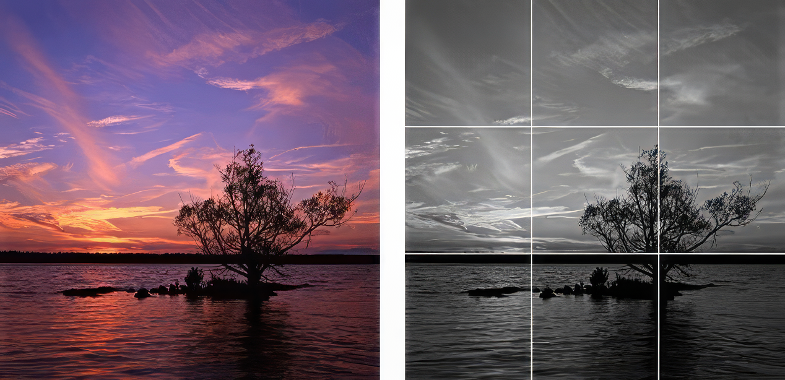

# Índice del Curso de Iniciación a la Fotografía Digital (1/2)

1. Introducción a la fotografía digital
2. Cámaras y tipos de cámaras
3. Funciones básicas de una cámara digital
4. Exposición: apertura, velocidad de obturación e ISO
5. Composición y regla de los tercios

---

# Índice del Curso de Iniciación a la Fotografía Digital (2/2)

6. Enfoque y profundidad de campo
7. Iluminación y uso del flash
8. Fotografía en diferentes condiciones de luz
9. Longitudes focales y sus tipos.
10. Edición básica de imágenes
11. Almacenamiento y organización de fotografías
12. Consejos para mejorar tus habilidades fotográficas

_Fuentes para ampliar información:_

-   [Fotografía digital para principiantes](https://www.fotografiadigitalparaprincipiantes.Wcom/)
-   [DZoom: Pasión por la fotografía](https://www.dzoom.org.es/)

---

# 1. Introducción a la Fotografía Digital (1/2)

## ¿Qué es la fotografía digital?

La fotografía digital es el proceso de capturar imágenes utilizando sensores electrónicos en lugar de película fotográfica. Las imágenes digitales se pueden almacenar, editar y compartir fácilmente en dispositivos electrónicos.

## Ventajas de la fotografía digital

-   Sin costes de película y revelado
-   Previsualización instantánea de las imágenes
-   Edición y manipulación de imágenes en el ordenador
-   Facilidad para compartir y almacenar fotografías

---

# 1. Introducción a la Fotografía Digital (2/2)

## Formatos de archivo comunes

-   JPEG: formato comprimido que reduce el tamaño del archivo a costa de la calidad de la imagen
-   RAW: formato sin comprimir que conserva todos los datos del sensor, ideal para la edición posterior
-   PNG: formato sin pérdida de calidad, utilizado principalmente para imágenes en la web

## Resolución y megapíxeles

-   La resolución de una imagen digital se mide en píxeles (ancho x alto)
-   Los megapíxeles (MP) son una medida de la cantidad de píxeles en una imagen (1 MP = 1 millón de píxeles)
-   Más megapíxeles no siempre significan mejor calidad de imagen

_Fuentes para ampliar información:_

-   [Introducción a la fotografía digital](https://www.fotonostra.com/digital/introduccion.htm)
-   [Ventajas de la fotografía digital](https://www.xatakafoto.com/basico/ventajas-de-la-fotografia-digital)

---

# 1/4. Introducción a la Fotografía Digital

## ¿Qué es la fotografía digital?

La fotografía digital es el proceso de capturar imágenes utilizando sensores electrónicos en lugar de película fotográfica. Las imágenes digitales se pueden almacenar, editar y compartir fácilmente en dispositivos electrónicos.

---

# 2/4. Introducción a la Fotografía Digital

## Ventajas de la fotografía digital

-   Sin costes de película y revelado
-   Previsualización instantánea de las imágenes
-   Edición y manipulación de imágenes en el ordenador
-   Facilidad para compartir y almacenar fotografías

---

# 3/4. Introducción a la Fotografía Digital

## Formatos de archivo comunes

-   JPEG: formato comprimido que reduce el tamaño del archivo a costa de la calidad de la imagen
-   RAW: formato sin comprimir que conserva todos los datos del sensor, ideal para la edición posterior
-   PNG: formato sin pérdida de calidad, utilizado principalmente para imágenes en la web

---

# 4/4. Introducción a la Fotografía Digital

## Resolución y megapíxeles

-   La resolución de una imagen digital se mide en píxeles (ancho x alto)
-   Los megapíxeles (MP) son una medida de la cantidad de píxeles en una imagen (1 MP = 1 millón de píxeles)
-   Más megapíxeles no siempre significan mejor calidad de imagen

_Fuentes para ampliar información:_

-   [Introducción a la fotografía digital](https://www.fotonostra.com/digital/introduccion.htm)
-   [Ventajas de la fotografía digital](https://www.xatakafoto.com/basico/ventajas-de-la-fotografia-digital)

---

# 1/3. Cámaras y Tipos de Cámaras

## Cámaras compactas

-   Pequeñas y ligeras
-   Lente fija (zoom óptico limitado)
-   Configuraciones automáticas y semi-automáticas
-   Ideal para fotografía casual y de viaje

---

# 2/3. Cámaras y Tipos de Cámaras

## Cámaras réflex (DSLR)

-   Mayor tamaño y peso
-   Lentes intercambiables
-   Configuraciones manuales y automáticas
-   Calidad de imagen superior
-   Ideal para aficionados y profesionales

---

# 3/3. Cámaras y Tipos de Cámaras

## Cámaras sin espejo (Mirrorless)

-   Tamaño y peso intermedio
-   Lentes intercambiables
-   Configuraciones manuales y automáticas
-   Calidad de imagen similar a las DSLR
-   Ideal para aficionados avanzados y profesionales

_Fuentes para ampliar información:_

-   [Tipos de cámaras fotográficas](https://www.dzoom.org.es/tipos-de-camaras-fotograficas/)
-   [Cámaras compactas, réflex y sin espejo](https://www.xatakafoto.com/guias-de-compra/camaras-compactas-reflex-y-sin-espejo-que-diferencias-hay-y-cual-me-compro)

---

# Tipos de Cámaras

|  |  |  |
| :-------------------------------------------------------------------------------------------------------------------------------------------------------------------------------------: | :---------------------------------------------------------------------------------------------------------------------------: | :-----------------------------------------------------------------------------------------------------------------------------------------------: |
|                                                 _Cámara compacta. Fuente: [Wikipedia](https://en.wikipedia.org/wiki/Canon_PowerShot_S)_                                                 |               _Cámara réflex (DSLR). Fuente: [Wikipedia](https://en.wikipedia.org/wiki/Canon_EOS_5D_Mark_III)_                |                  _Cámara sin espejo (Mirrorless). Fuente: [Wikipedia](https://en.wikipedia.org/wiki/Olympus_OM-D_E-M1_Mark_II)_                   |

---

# 1/3. Funciones Básicas de una Cámara Digital

## Modos de disparo

-   Automático: la cámara ajusta todos los parámetros automáticamente
-   Programado (P): la cámara ajusta la apertura y la velocidad de obturación, pero permite controlar otros ajustes
-   Prioridad de apertura (A/Av): el usuario controla la apertura, y la cámara ajusta la velocidad de obturación
-   Prioridad de obturación (S/Tv): el usuario controla la velocidad de obturación, y la cámara ajusta la apertura
-   Manual (M): el usuario controla todos los ajustes, incluyendo apertura y velocidad de obturación

---

# 2/3. Funciones Básicas de una Cámara Digital

## Balance de blancos

-   Ajusta el color de la luz en la escena para que los objetos blancos aparezcan blancos
-   Puede ajustarse automáticamente o seleccionar un ajuste preestablecido (luz del día, sombra, tungsteno, fluorescente, etc.)

## Modos de medición

-   Medición evaluativa/matricial: mide la luz en múltiples puntos de la escena y calcula una exposición equilibrada
-   Medición puntual: mide la luz en un punto específico de la escena (por ejemplo, el centro)
-   Medición ponderada al centro: mide la luz en el centro de la escena y en un área circundante, dando más peso al centro

---

# 3/3. Funciones Básicas de una Cámara Digital

## Modos de enfoque

-   Enfoque automático (AF): la cámara enfoca automáticamente al pulsar el disparador hasta la mitad
-   Enfoque manual (MF): el usuario ajusta el enfoque girando el anillo de enfoque en el objetivo
-   AF-S/One-Shot: enfoque automático para sujetos estáticos
-   AF-C/AI Servo: enfoque automático continuo para sujetos en movimiento

_Fuentes para ampliar información:_

-   [Funciones básicas de una cámara digital](https://www.fotonostra.com/digital/funciones.htm)
-   [Modos de disparo y medición](https://www.dzoom.org.es/modos-de-disparo-y-mediciones-de-luz/)

---

# 1/3. Exposición: Apertura, Velocidad de Obturación e ISO

## Apertura (f)

-   Controla la cantidad de luz que entra en la cámara a través del objetivo
-   Representada por el número f (f/1.8, f/4, f/8, etc.)
-   Números f más bajos indican una apertura más amplia (más luz)
-   Afecta la profundidad de campo (zonas enfocadas y desenfocadas)

---

# 2/3. Exposición: Apertura, Velocidad de Obturación e ISO

## Velocidad de obturación

-   Controla la cantidad de tiempo que el sensor de la cámara está expuesto a la luz
-   Representada en segundos o fracciones de segundo (1/60, 1/125, 1/250, etc.)
-   Velocidades de obturación más rápidas congelan el movimiento, mientras que velocidades más lentas pueden causar desenfoque de movimiento
-   Afecta la nitidez de la imagen y la captura de movimiento

---

# 3/3. Exposición: Apertura, Velocidad de Obturación e ISO

## ISO

-   Controla la sensibilidad del sensor de la cámara a la luz
-   Representada por un número (100, 200, 400, 800, etc.)
-   Valores de ISO más altos permiten capturar imágenes en condiciones de poca luz, pero pueden introducir ruido en la imagen
-   Afecta la calidad y el grano de la imagen

_Fuentes para ampliar información:_

-   [Exposición: Apertura, Velocidad de Obturación e ISO](https://www.dzoom.org.es/exposicion-apertura-velocidad-de-obturacion-e-iso/)
-   [Entender la exposición en fotografía](https://www.xatakafoto.com/basico/entender-la-exposicion-en-fotografia)

---

<!-- _class: full-image -->

# Triángulo de Exposición

_Triángulo de exposición: Apertura, Velocidad de obturación e ISO. Fuente: [Wikipedia](https://es.wikipedia.org/wiki/Exposici%C3%B3n_%28fotograf%C3%ADa%29)\_

---

# 1/2. Composición y Regla de los Tercios

## Composición

-   La disposición de los elementos en una fotografía
-   Ayuda a guiar la atención del espectador y a transmitir un mensaje o emoción
-   La composición efectiva puede mejorar la calidad y el impacto de una imagen

## Regla de los tercios

-   Divide la imagen en una cuadrícula de 3x3
-   Coloca los elementos importantes en las intersecciones o a lo largo de las líneas de la cuadrícula
-   Ayuda a crear imágenes más equilibradas y atractivas visualmente

---

<!-- _class: full-image -->

# 2/2. Composición y Regla de los Tercios

_Pie de imagen: Ejemplo de la regla de los tercios. Fuente: [Wikipedia](https://es.wikipedia.org/wiki/Regla_de_los_tercios)_

_Fuentes para ampliar información:_

-   [Composición fotográfica](https://www.dzoom.org.es/reglas-de-composicion-fotografica/)
-   [Regla de los tercios](https://www.dzoom.org.es/regla-de-los-tercios/)

---

# 1/2. Enfoque y Profundidad de Campo

## Enfoque

-   Ajuste que determina qué partes de la imagen aparecen nítidas y claras
-   Puede ser automático (AF) o manual (MF)
-   El enfoque selectivo puede resaltar un sujeto y desenfocar el fondo

## Profundidad de campo

-   Rango de distancia en una imagen donde los objetos aparecen nítidos y enfocados
-   Afectada por la apertura, la distancia focal y la distancia al sujeto
-   Aperturas más pequeñas (números f más altos) aumentan la profundidad de campo

---

# 2/2. Enfoque y Profundidad de Campo

## Consejos para controlar la profundidad de campo

-   Utiliza una apertura más amplia (números f más bajos) para reducir la profundidad de campo y desenfocar el fondo
-   Utiliza una apertura más estrecha (números f más altos) para aumentar la profundidad de campo y mantener más elementos enfocados
-   La distancia focal y la distancia al sujeto también afectan la profundidad de campo

_Fuentes para ampliar información:_

-   [Enfoque y profundidad de campo](https://www.dzoom.org.es/enfoque-y-profundidad-de-campo/)
-   [Controlar la profundidad de campo](https://www.xatakafoto.com/basico/como-controlar-la-profundidad-de-campo)

---

# 1/2. Iluminación y Uso del Flash

## Iluminación

-   Esencial para capturar imágenes de alta calidad
-   La luz natural es a menudo la mejor fuente de iluminación
-   La dirección, intensidad y calidad de la luz afectan la apariencia de la imagen

## Uso del flash

-   Proporciona luz adicional cuando la iluminación es insuficiente
-   Puede ser integrado en la cámara o externo (flash de zapata)
-   Útil para rellenar sombras o iluminar sujetos en condiciones de poca luz

---

# 2/2. Iluminación y Uso del Flash

## Consejos para usar el flash

-   Evita el flash directo: puede causar sombras duras y reflejos no deseados
-   Utiliza un difusor o rebota el flash en una superficie para suavizar la luz
-   Ajusta la potencia del flash y la distancia al sujeto para controlar la intensidad de la luz

_Fuentes para ampliar información:_

-   [Iluminación en fotografía](https://www.dzoom.org.es/iluminacion-en-fotografia/)
-   [Uso del flash](https://www.xatakafoto.com/basico/uso-del-flash-en-fotografia)

---

# 1/2. Fotografía en Diferentes Condiciones de Luz

## Fotografía diurna

-   La luz del sol proporciona una iluminación natural y uniforme
-   La posición del sol afecta la dirección e intensidad de la luz
-   La hora dorada y la hora azul ofrecen una luz suave y cálida ideal para la fotografía

## Fotografía nocturna

-   Requiere una mayor atención al control de la exposición
-   Utiliza velocidades de obturación más lentas, aperturas más amplias y valores de ISO más altos
-   Un trípode puede ser útil para evitar el desenfoque por movimiento

---

# 2/2. Fotografía en Diferentes Condiciones de Luz

## Fotografía en interiores

-   La iluminación artificial puede variar en temperatura y calidad de color
-   Ajusta el balance de blancos para obtener colores precisos
-   Utiliza el flash o aumenta el ISO para compensar la falta de luz

## Fotografía en contraluz

-   Ocurre cuando la fuente de luz está detrás del sujeto
-   Puede causar siluetas y falta de detalle en el sujeto
-   Utiliza el flash de relleno o ajusta la exposición para compensar el contraluz

_Fuentes para ampliar información:_

-   [Fotografía en diferentes condiciones de luz](https://www.dzoom.org.es/fotografia-en-diferentes-condiciones-de-luz/)
-   [Consejos para fotografiar en contraluz](https://www.xatakafoto.com/trucos-y-consejos/consejos-para-fotografiar-en-contraluz)

---

# 1/2. Longitudes Focales y sus Tipos

## Longitud focal

-   La distancia entre el objetivo y el sensor de la cámara
-   Afecta el ángulo de visión, la perspectiva y la profundidad de campo
-   Se mide en milímetros (mm)

## Tipos de longitudes focales

1. Gran angular: menor a 35mm
2. Normal: alrededor de 50mm
3. Teleobjetivo: mayor a 70mm

---

# 2/2. Longitudes Focales y sus Tipos

## Usos y efectos ópticos

-   Gran angular: captura un ángulo de visión amplio, ideal para paisajes y arquitectura; puede causar distorsión en los bordes
-   Normal: reproduce una perspectiva similar a la visión humana, ideal para retratos y fotografía callejera
-   Teleobjetivo: acerca objetos distantes, ideal para fotografía de deportes y vida silvestre; comprime la perspectiva y aísla el sujeto

_Fuentes para ampliar información:_

-   [Longitudes focales y sus efectos](https://www.dzoom.org.es/longitudes-focales-y-sus-efectos/)
-   [Tipos de objetivos y sus usos](https://www.xatakafoto.com/basico/tipos-de-objetivos-y-sus-usos)
